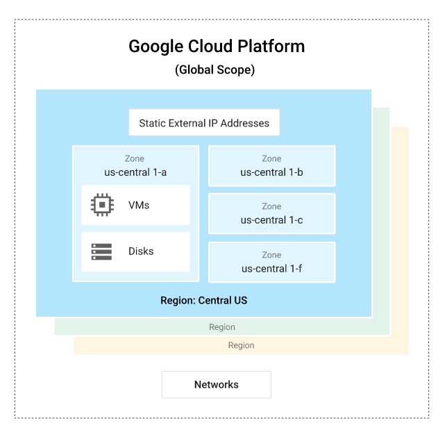
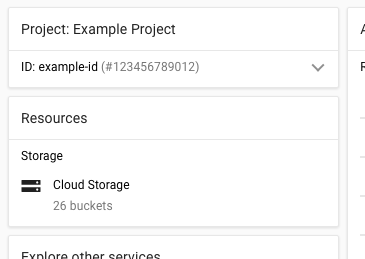

# GCP

# **목차**

### **Google Cloud 개요, 개념**

- Google Cloud는 컴퓨터, 하드 디스크 같은 물리적 자산과 VM과 같은 가상 리소스로 구성됨. 과거엔 SW 및 HW 제품으로 간주했던 요소가 클라우드 컴퓨팅에서는 ‘서비스’가 됨.
- 전역, 리전(region), 영역 리소스
    - 전역 리소스 - 여러 리전과 영역에서 다른 리소스를 통해 액세스 할 수 있음. (ex: 사전 구성된 디스크 이미지, 디스크 스냅샷, 네트워크)
    - 리전 리소스 – 같은 리전에 있는 리소스에서만 액세스 가능 (ex: 고정 외부 IP 주소)
    - 영역 리소스 – 같은 영역에 있는 리소스에서만 액세스 가능 (ex: VM 인스턴스, 인스턴스의 유형, 디스크)

- 작업의 범위는 다루는 리소스의 종류에 따라 달라짐. 네트워크는 전역 리소스이므로 네트워크 생성은 전역 작업이지만 주소는 리전 리소스이므로 IP 주소 예약은 리전 작업
- 할당 및 사용하는 모든 Google Cloud리소스는 하나의 프로젝트에 속해야 함. 프로젝트는 빌드할 항목을 정리하는 개체라고 생각할 수 있고 설정, 권한, 애플리케이션을 설명하는 기타 메타데이터로 구성됨.
- 공유 VPC 또는 VPC 네트워크 피어링을 사용하지 않는 한 프로젝트는 다른 프로젝트의 리소스에 액세스 할 수 없음
- Google Cloud 프로젝트가 포함하는 항목
    - 사용자가 제공하는 프로젝트 이름
    - 사용자가 제공하거나 Google Cloud에서 사용자 대신 제공할 수 있는 프로젝트 ID
    - Google Cloud에서 제공하는 프로젝트 번호

- 프로젝트의 이름, ID, 번호
- 프로젝트 ID는 Google Cloud 전체에서 고유함. 다시 사용할 수 없음.
- 프로젝트는 네임스페이스 역할을 하며 각 프로젝트 내 모든 리소스는 고유한 이름을 가져야 함. (별개 프로젝트인 경우 일반적으로 다시 리소스 이름 사용 가능)
- 서비스, 리소스와 상호작용하는 법
    - Google Cloud Console
        - 웹 기반
    - 명령줄 인터페이스
        - Gcloud 명령줄 사용해 대부분의 작업 수행 가능. gcloud 명령어는 Cloud SDK를 설치하거나 브라우저 기반의 Cloud Shell 사용하면 됨
    - 클라이언트 라이브러리
        - 앱 API는 서비스에 대한 액세스 제공
        - 관리자 API는 리소스 관리를 위한 기능 제공

### **Google Cloud 서비스 정보**

- 컴퓨팅 및 호스팅 서비스를 위한 옵션들
    - 서버리스 환경에서 작업
        - Google Cloud의 서비스로서 기능(FaaS)인 Cloud Functions는 클라우드 서비스 빌드 및 연결을 위한 서버리스 실행 환경 제공
        - 함수는 감시중인 event 발생 시 트리거 되고, 코드는 완전 관리형 환경에서 실행됨로 인프라를 프로비저닝하거나 서버를 관리할 필요 없음
        - Cloud Functions는 다음에 적합
            - 동영상 트랜스코딩, IoT 스트리밍 데이터와 같은 시나리오 위한 데이터 처리 및 ETL 작업
            - HTTP 트리거에 응답하기 위한 웹훅
            - 느슨하게 결합된 논리를 애플리케이션으로 구성하는 경량 API
            - 모바일 백엔드 함수
    - 관리형 애플리케이션 플랫폼 사용
        - App Engine은 Google Cloud의 Paas이고 구글은 App Engine을 사용해 대부분의 리소스 관리를 처리함
        - 시스템 SW에 보안 업데이트가 필요하면 자동으로 처리
        - App engine에서 앱 빌드시 다음을 수행 가능
            - GO, Java, .NET, Node.js, PHP, Python, Ruby에서 앱 빌드하고 사전 구성된 런타임을 사용하거나 커스텀 런타임 사용해 모든 언어로 코드 작성
            - Google이 앱 호스팅, 확장, 모니터링, 인프라를 자동으로 관리하게 가능
            - Google Cloud Storage 제품에 연결, 관리형 Redis DB에 연결해 타사 DB 호스팅 가능
            - Web Security Scanner 사용해 보안 취약성 식별 가능
    - 유연성 확보 위해 컨테이너 기술(GKE) 활용
        - 컨테이너 기반 컴퓨팅에서는 호스팅 환경에 대한 배포, 통합 대신 애플리케이션 코드에 집중할 수 있음
        - Google Cloud의 CaaS(서비스로서의 컨테이너)인 Google Kubernates Engine(GKE)는 오픈소스 Kubernetes 시스템을 기반을 구축되어 온프레미스 또는 하이브리드 클라우드를 선택할 수 있는 유연성 제공
        - GKE 사용해 빌드할 경우
            - 클러스터라는 Kybernetes 실행 Compute Engine 인스턴스 그룹을 만들고 관리. 인스턴스를 클러스터의 노드로 사용
            - 단순 JSON 구성 파일 생성해 Docker 컨테이너의 요구사항 선언
            - 단일 및 다중 컨테이너 pod를 생성. 각 pod는 하나 이상의 컨테이너를 포함할 수 있는 논리적 host를 나타냄. pod에 포함도니 컨테이너는 네트워킹 리소스와 같은 리소스를 공유해 함께 작동 → 여러 pod 집합이 하나로 작동하여 전체 애플리케이션, 마이크로서비스, 다중 계층 애플리케이션의 한 계층을 구성할 수 있음
            - 복제 컨트롤러(템플릿을 기준으로 pod 복제본의 생성 및 삭제를 관리하는 것)를 만들고 관리
            - 서비스를 만들고 관리함. 서비스는 back-end 기능을 제공하는 pod에서 front-end 클라이언트를 분리하는 추상화 계층을 생성함 → 클라이언트가 특정 시점에 생성, 삭제되는 pod가 무엇인지 확인할 필요 없이 작동할 수 있음
            - 외부 네트워크 부하 분산기 생성
    - 최대한의 제어 및 유연성 확보를 위해 고유한 클라우드 기반 인프라 구축
    - 가상머신
        - Google Cloud의 비관리형 컴퓨팅 서비스는 Compute Engine(Azure에서의 VM을 의미)이며 Compute Engine은 Infrastucture ass a Service(Iaas)를 제공하는 것으로 인식 가능함. 시스템이 강력한 컴퓨팅 인프라를 제공하지만 사용하려는 플랫폼 구성요소를 개발자가 선택하고 구성해야 함.
        - 리소스의 가용성,준비성,안정성은 Google의 관할이지만 리소스의 프로비저닝과 관리는 개발자의 담당 → 개발자의 제어 + 무제한의 유연성
        - Compute Engine에서 빌드하는 경우
            - 인스턴스라고 부르는 가상 머신(VM)을 사용해 애플리케이션 빌드
            - 리소스 배포할 리전, 영역 선택해 데이터의 저장과 사용 위치 제어
            - 원하는 OS, 개발 스택, 언어, 프레임워크 등 선택
            - Google Cloud Storage 기술 또는 타사 기술 사용 가능
            - Google Cloud Marketplace 사용해 미리 구성된 SW 패키지 배포 가능
            - 여러 인스턴스를 하나로 쉽게 관리할 수 있도록 인스턴스 그룹 생성 가능 → 인스턴스 그룹 사용한 자동 확장을 사용해 용량을 자동으로 추가&삭제
            - 필요에 따라 디스크 연결, 분리 가능
            - SSH 사용해 인스턴스에 직접 연결
    - 컴퓨팅 및 호스팅 옵션 결합
        - 컴퓨팅 서비스 유형을 하나만 사용할 필요 X
        - 예를 들어 App Engine과 Compute Engine 결합하면 두 유형의 기능과 이점 모두 사용 가능
- 스토리지 서비스
    - 애플리케이션에 관계없이 일부 미디어 파일, 백업 또는 파일과 유사한 다른 객체를 저장해야 할 수 있음. Google Cloud는 다양한 스토리지 서비스 제공
        - Cloud Storage
            - 여러 옵션으로 제공됨
        - Compute Engine의 영구 디스크
            - 인스턴스의 기본 스토리지로 사용되며 하드 디스크 기반 및 SSD 영구 디스크 제공
        - Filestore의 완전 관리형 NFS 파일 서버. Filestore 인스턴스 사용해 Compute Engine VM 인스턴스 또는 GKE 클러스터에서 실행되는 애플리케이션의 데이터를 저장할 수 있음
- 데이터베이스 서비스
    - Google Cloud는 다양한 SQL 및 NoSQL DB 서비스를 제공함
        - Cloud SQL의 SQL DB
            - MySQL
            - PostgreSQL
        - Cloud Spanner의 완전 관리형 미션 크리티컬 관계형 DB 서비스
            - 전역 규모에서의 트랜잭션 일관성, 스키마, SQL 쿼리, 고가용성을 위한 자동 동기식 복제
        - NoSQL데이터 스토리지 위한 두 가지 옵션
            - Firestore: 문서와 유사한 데이터의 경우
            - Cloud Bigtable: 표 형식 데이터의 경우
- 네트워킹 서비스
    - 네트워크, 방화벽, 경로
        - Virtual Private Cloud(VPC)는 VM 인스턴스가 사용하는 네트워킹 서비스 집합을 제공. 인스턴스에는 2개 이상의 인터페이스가 있을 수 있지만 각 인터페이스는 다른 네트워크에 연결되어야 함. 모든 VPC 프로젝트에는 기본 네트워크가 있음
        - 방화벽 규칙은 네트워크의 인스턴스로 들어오는 트래픽 제어. 개발자가 커스텀 규칙 만드는 것도 가능
        - 경로를 사용하면 인스턴스에서 VPN 만들기와 같은 고급 네트워킹 기능 구현 가능. 경로는 인스턴스를 나가는 패킷의 대상 지정
    - 부하분산
        - 웹사이트 또는 애플리케이션이 Compute Engine에서 실행될 때는 여러 인스턴스 간에 워크로드를 분산해야 할 경우가 발생할 수 있음.
        - 서버 측 부하 분산 기능이 제공하는 옵션
            - 네트워크 부하 분산
                - 주소, 포트, 프로토콜과 같이 들어오는 IP 프로토콜 데이터를 기준으로 동일 리전에 있는 서버 인스턴스 간 트래픽 분산 가능. *웹사이트에 들어오는 트래픽의 수요를 충족시키려는 경우에 효과가 뛰어난 솔루션*
                - HTTP(S) 부하 분산을 사용하면 콘텐츠 유형에 따라 트래픽 분산 가능
    - Cloud DNS
        - Google에서 사용되는 것과 동일한 인프라를 사용해 DNS(도메인 이름 시스템)을 게시하고 유지 관리할 수 있음. Google Cloud Console, 명령줄 또는 REST API사용해 관리형 영역 및 DNS 레코드 관리 가능
    - 고급 연결
        - Google Cloud 리소스에 연결하려는 기존 네트워크가 있는 경우 제공하는 고급 연결 옵션
            - Cloud Interconnect 사용시 가용성 높고 지연 시간 낮은 엔터프라이즈급 연결 통해 VPC 네트워크에 기존 네트워크 연결 가능
            - Cloud VPN 사용시 IPSec 연결 통해 VPC 네트워크에 기존 네트워크 연결 가능. 또한 VPN 사용하여 2개의 Cloud VPN 게이트워이를 서로 연결할 수 있음.
            - 다이렉트 피어링 사용시 Google의 연결 에지 네트워크 위치 중 하나에서 네트워크과 Google 네트워크 사이 인터넷 트래픽 교환 가능
            - 이동통신사 피어링 사용시 가용성 높고 지연 시간 낮은 연결을 통해 (서비스 제공업체 사용) Google의 네트워크 에지에 인프라 연결 가능
- 빅데이터 서비스
    - 데이터분석
        - BigQuery는 데이터 분석 서비스를 제공하며 다음과 같은 작업이 수행 가능함
            - 데이터를 데이터세트와 테이블로 구성하는 커스텀 스키마 생성
            - 스트리밍 데이터를 포함해 여러 소스에서 데이터 로드
            - SQL과 비슷한 명령을 사용해 데용량 데이터세트를 매우 빠르게 쿼리.
            - 웹 UI, 명령줄 인터페이스, API 사용
            - 작업 사용해 데이터 로드, 쿼리, 내보내기, 보사
            - 권한 사용해 데이터 관리, 보호
    - 일괄처리 및 스트리밍 데이터 처리
        - Dataflow는 일괄 처리 및 스트리밍 데이터 처리 작업을 수행하는 데 사용할 수 있는 관리형 서비스 및 SDK 집합 제공, Dataflow는 특히 처리 작업을 병렬 워크로드로 쉽고 명확하게 구분할 수 있는 경우의 대용량 컴퓨팅에 적합히며, ETL(추출-변환-로드) 작업과 여러 스토리지 미디어간 데이터 이동 또는 적절한 형식으로 변환 등에도 유용
    - 비동기 메시징
        - Pub/Sub은 비동기 메시징 서비스이며 이 항목은 전역 리소스이기 때문에 개발자가 소유하는 프로젝트에 있는 다른 애플리케이션은 해당 주제를 구독해 HTTP 요청 또는 응답 본문의 메시지를 수신할 수 있음
        - Pub/Sub은 빅데이터 뿐만 아니라 여러 상황에서 사용가능
- 머신러닝 서비스
    - Machine learning API
        - Video Intelligence API에서는 라벨 인식, 샷 변경 감지 등의 기능을 제공하는 동영상 분석 기술 사용 가능
        - 음성 텍스트 변환을 사용하면 110개 이상의 언어 및 그 변형을 인식해 오디오 텍스트 변환을 수행 → 전 세계 사용자층 지원 가능
        - Cloud Vision 사용해 이미지 라벨링, 광학 문자 인식 등의 시각적 감지 기능 통합 가능
        - Cloud Natural Language API를 사용해 감정 분석, 항목 분석, 콘텐츠 분류 등 추가 가능
        - Cloud Translation 사용해 소스 텍스트 빠르게 변역 가능 ← 출발 언어 모르는 경우에 유용할 것임
        - Dialogflow 사용해 웹사이트, 모바일 어플리케이션 등을 위한 대화형 인터페이스 빌드 가능. 이를 사용하면 챗봇과 같은 인터페이스를 빌드할 수 있음
    - AI Platform
        - AI Platform을 사용하면 Google Cloud에서 tensorflow 학습 애플리케이션을 실행하여 ML 모델을 학습시키고 이러한 모델을 호스팅해 새로운 data 예측을 위해 사용할 수 있음. AI Platform은 학습 작업을 실행해야 하는 컴퓨팅 리소스를 관리해 개발자가 HW구성 또는 리소스 관리 대신 모델이 더 집중할 수 있게 해줌
